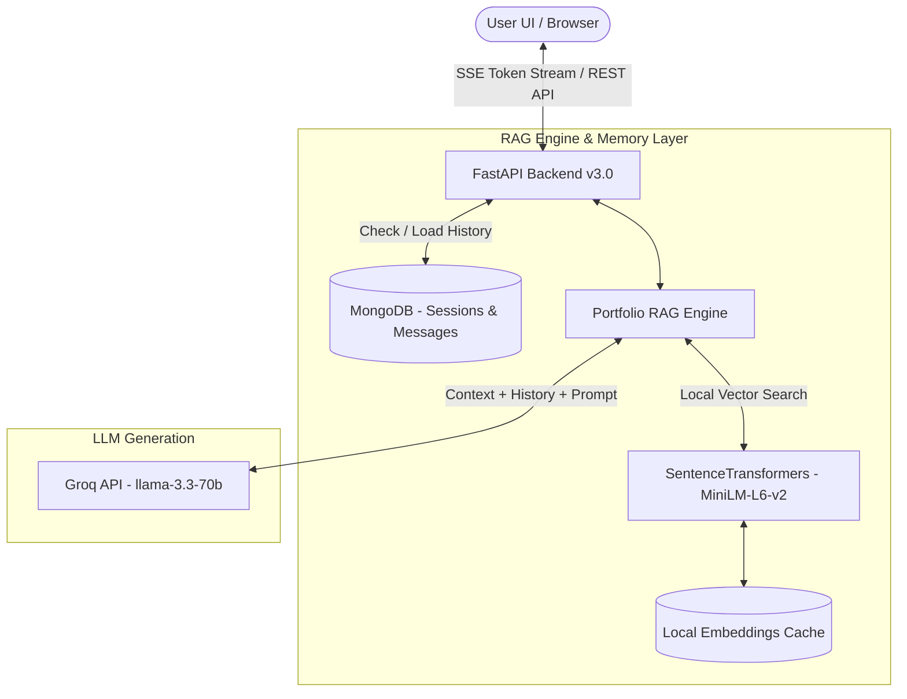

# ⚡ yug.ai — Production RAG & Multi-Turn Conversational AI Portfolio

[](https://www.python.org/)
[](https://fastapi.tiangolo.com/)
[](https://groq.com/)
[](https://huggingface.co/sentence-transformers/all-MiniLM-L6-v2)
[](https://www.mongodb.com/)
[](https://react.dev/)
[](https://www.typescriptlang.org/)
[](LICENSE)

An enterprise-grade, agentic portfolio assistant featuring **Context-Aware Retrieval-Augmented Generation (RAG)**, **Real-Time Token SSE Streaming**, **Zero-Cost Local Embeddings**, **Multi-Turn Conversational Memory**, and **Persistent MongoDB Chat Windows**.

---

## 🌟 Key Features

- 🧠 **Context-Aware Multi-Turn Memory**: Remembers previous questions and responses across turns. When a user asks a follow-up question like *"tell me more about it"* or *"what tech stack did he use?"*, the RAG engine automatically expands the vector query with context from previous turns to retrieve exact domain information.
- 📂 **Multi-Session MongoDB Chat Windows**: Persistent chat drawer allowing users to create new chat windows, switch between saved sessions, auto-generate titles from initial queries, and delete past conversations.
- ⚡ **Real-Time SSE Token Streaming**: Server-Sent Events (SSE) streaming API powered by Groq's `llama-3.3-70b-versatile` model for sub-second, token-by-token UI response rendering.
- 🔍 **Zero-Cost Local Vector Search**: Built with `sentence-transformers (all-MiniLM-L6-v2)` for local document embedding with MD5 cache hashing, eliminating third-party embedding API costs.
- 🎨 **Futuristic UI & Glassmorphism Aesthetic**: Designed with Vite, React 18, Tailwind CSS, Framer Motion animations, interactive 3D skill orbit avatar, dynamic canvas mouse trail, and optional audio FX (Web Audio API).

---

## 🏗️ System Architecture



---

## 📁 Repository Structure

```
yug-ai-portfolio/
├── backend/
│   ├── data/                   # Portfolio knowledge base (.txt source files)
│   ├── database.py             # MongoDB connection & CRUD for sessions & messages
│   ├── main.py                 # FastAPI SSE streaming routes & endpoint handlers
│   ├── rag.py                  # RAG Chunker, Local Embedder, & Memory Engine
│   ├── requirements.txt        # Python backend dependencies
│   └── .env.example            # Environment variables template
├── src/
│   ├── components/
│   │   ├── ChatContainer.tsx   # macOS-style Chat Window with +New Chat & Session controls
│   │   ├── ChatSidebar.tsx     # Slide-out MongoDB Chat History drawer
│   │   ├── SkillOrbit.tsx      # Interactive 3D Orbit skills component
│   │   └── icons.tsx           # SVG icon collection
│   ├── utils/
│   │   └── audio.ts            # Web Audio API sound synthesis
│   ├── App.tsx                 # Main Application Layout & State Hydration
│   ├── index.css               # Design System & Aurora CSS styling
│   └── main.tsx                # React Root Entrypoint
├── package.json                # Frontend dependencies & scripts
├── vite.config.ts              # Vite bundler configuration
└── README.md                   # System Documentation
```

---

## 🚀 Quickstart & Setup Guide

To get the application up and running locally, please refer to our comprehensive step-by-step setup guide:

👉 **[Setup and Installation Guide (setup.md)](file:///c:/Users/yugag/OneDrive/Desktop/yug-ai-portfolio/setup.md)**

This guide covers:
- System prerequisites (Node.js, Python, MongoDB, Groq API)
- Backend virtual environment and API configuration
- Frontend dependency installation and development server start
- Troubleshooting common issues

---


## 📝 Customizing Portfolio Knowledge Base

To customize the AI assistant with your own profile, experience, and projects:

1. Open `backend/data/portfolio_info.txt`.
2. Update the structured sections (`Personal Introduction`, `Professional Experience`, `Project Portfolio`, `Detailed Technical Skills List`) with your information.
3. You can also add additional `.txt` files inside `backend/data/`. The RAG engine automatically scans all text documents, splits sections into smart chunks, and regenerates vector embeddings whenever content is updated!

---

## 📡 API Reference

| Endpoint | Method | Description |
| :--- | :---: | :--- |
| `GET /` | `GET` | API Health Check & engine information |
| `POST /query/stream` | `POST` | SSE Streaming RAG endpoint (accepts `query`, `session_id`) |
| `GET /chats` | `GET` | Returns all chat sessions sorted by most recent activity |
| `POST /chats` | `POST` | Creates a new chat session window |
| `GET /chats/{session_id}/messages` | `GET` | Fetches all messages for a specific session |
| `PATCH /chats/{session_id}` | `PATCH` | Renames a chat session |
| `DELETE /chats/{session_id}` | `DELETE` | Deletes a chat session and its stored messages |

---

## 🔒 Security & Privacy

- **Environment Variables**: API keys and database connection strings are never committed (`.env` is listed in `.gitignore`).
- **Input Validation**: FastAPI request body schemas validate query string length and character limits.
- **Safety Filters**: RAG system prompt strictly enforces scope restriction and guards against prompt injection or wage leakage.

---

## 👤 Author

**Yugen Agarwal**
- Portfolio: `yug.ai`
- Email: [yugagarwal214@gmail.com](mailto:yugagarwal214@gmail.com)

---

## 📄 License

This project is licensed under the [MIT License](LICENSE).
